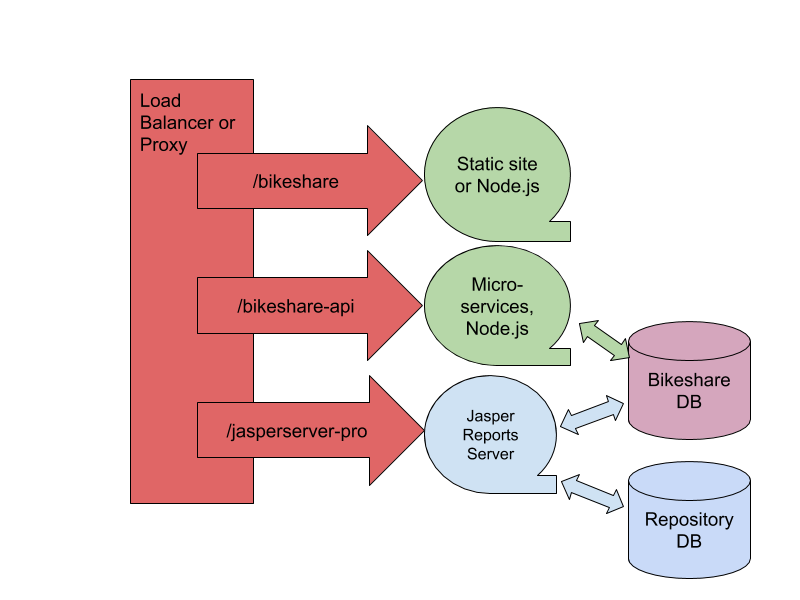

# TIBCO Jaspersoft Bikeshare Demo

This TIBCO Jaspersoft Bikeshare Demonstration Application is designed to show the best practices of a user experience and web application design process and implementation, leveraging Jaspersoft's "embedded BI" data visualizations, reports and self service.

# Components in directories

* UI
    * React/Typescript web app
    * Deployed as a static web site or run as a node app in development mode: “npm start”

* API
    * Node.js Express app

* Data
    * bikeshare-backup.zip: Postgres database backup to be restored with psql
    * Development SQL scripts
    * ETL data load jobs

* Reports
    * Bikeshare-JRS-export.zip creates /public/Bikeshare_demo folder and contents
    * Base JRXMLs in a Studio project

* JSSConfig
    * Updated JAR(s)

* JRSConfig
    * Additional/updated JARs and appContext

* Auth
    * Token for auth and encrypt process

* Deploy
    * AWS CodePipeline and Docker deployment


# Deployment Architecture



# Manual Setup

## Bikeshare database
  * Unzip the `Data/bikeshare_backup.zip.*` Creates a `bikeshare_backup.sql` file.
     * 7zip on Windows will automatically unzip it
     * On Linux, `cat bikeshare_backup.zip.* > bikeshare_backup.zip`
  * Connect to your your Postgres database
  * psql -host XXX -U <user>
  * create database bikeshare;
  * \c bikeshare
  * \i `<path_to_js-bikeshare-demo/Data/bikeshare_backup.sql`
  * \i `<path_to_js-bikeshare-demo/Data/updates_to_bikeshare.sql`

## JasperReports Server
  * Install JRS with the Github `/JRSConfig` additions
  * Import the JRS repo export from Github `/Reports`
    * BS-server-settings-export.zip
    * Bikeshare-JRS-export.zip
  * Create the Bikeshare orgs and users
    * Add a “BikeShare” org manually
    * Import Bikeshare_org_user_export.zip into the new Bikeshare org.

        * If you get: `import from superuser does not work Import of an organization to the root is not allowed.`, that means you tried to import into the root org, which does not work in JasperReports Server. Use the new organization’s jasperadmin account.

        * Note: There will be a few “access denied” on resources under the public folder, you can ignore them.

  * Within JRS, update the server attributes affecting the Bikeshare data Source :
      * bikeshareDBHost
      * bikeshareDBPort
      * bikeshareDBUsername
      * bikeshareDBPassword
      * bikeshareDBSchema

## Proxy
You need to set up a proxy. Have the proxy in front of the Bikeshare web app, API and JasperReports Server. See the deploy/docker-compose.yml and haproxy.cfg for ideas.

## Bikeshare Web application
1. cd UI
1. npm install
1. npm start
    * will launch web app on http://localhost:3000 (Do the UI configuration (below) first)
    * Running like this will have CORS issues when the app accessed JRS directly: so use the Docker config to run a haproxy
1. *OR* npm run build
    * builds a static web site in UI/build
    * This can be copied to a web server like nginx
      
## Bikeshare microservices API
1. cd API
1. npm install
1. npm start
    * will launch web app on http://localhost:8888

# Docker deployment

Dockerfiles in:
* /API: API in node
* /UI: static web site in nginx

```
/deploy/Docker/docker-compose.yml
/deploy/Docker/haproxy.cfg
```

1. Run UI and API images behind HAproxy.
1. Need to set domain etc of JasperReports Server in haproxy.cfg.
1. Need to set Postgres bikeshare database config in /API


# Configuration files    

## UI/.env*

```
REACT_APP_JASPERSERVER_URL="/jasperserver-pro"
REACT_APP_API_URL="/bikeshare-api"
# base folder to display in Manager > Reports and Dashboards
REACT_APP_REPOSITORY_START_FOLDER=/Reports
```
Used with npm start.

## UI/.env.production

As above, plus:

```
# for Docker static deployment only
STATIC_BIKESHARE_APP_PATH=/var/www/bikeshare
```
Used with npm run build.

## API/.env

```
POSTGRES_HOST=localhost
POSTGRES_PORT=5432
POSTGRES_USER=postgres
POSTGRES_PASSWORD=postgres
POSTGRES_DB=bikeshare_v2
PORT=8888
#DEBUG=express:*
#API_PATH=/bikeshare-api

SESSION_SECRET=bikeshare
```

Change to point to your Bikeshare Postgres database, as per the JasperReports Server data source settings above.


